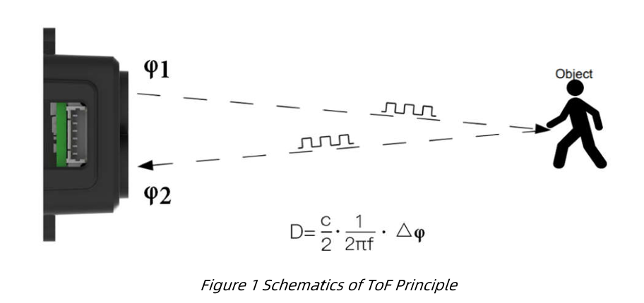
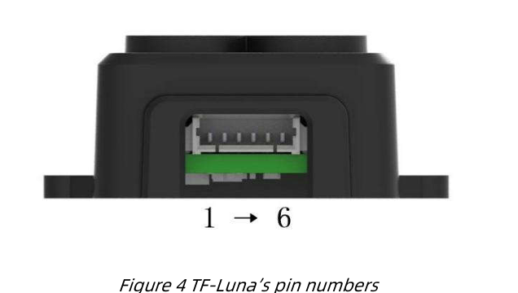
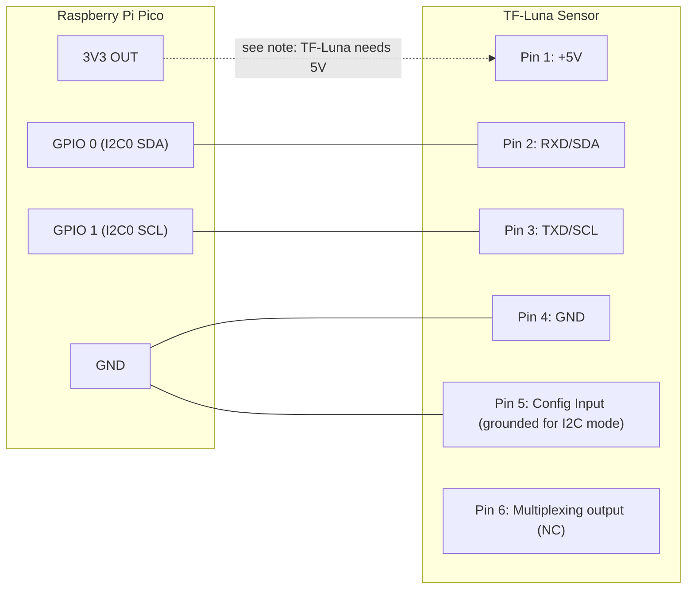
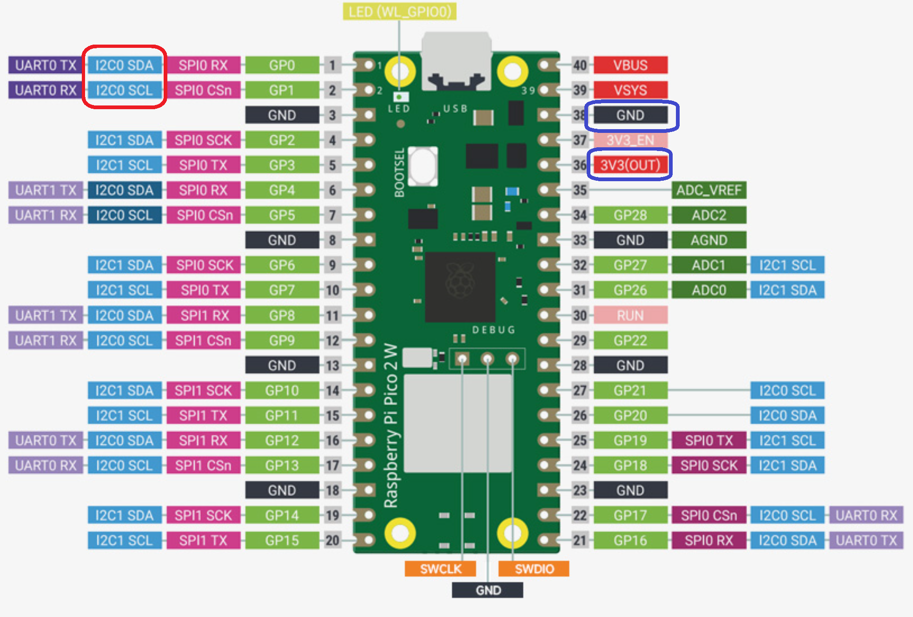

# RpiPicoBleSvc

Raspberry Pi Pico (Arduino-Pico core) BLE peripheral firmware that reads a TF-Luna I2C distance sensor and exposes it as a BLE GATT service to the Windows clients in this workspace.

## Files

- `RpiPicoBleSvc.ino` — BLE service setup, characteristic wiring, and main loop
- `tf-luma.h` / `tf-luma.cpp` — TF-Luna I2C sensor driver wrapper
- `btstack_config.h` — BTstack BLE stack configuration

## TF-Luma Device

### Parameters specification of TF-Luna

| Description | Parameter value |
|---|---|
| Operating range | 0.2m ~ 8m |
| Accuracy | ±6cm @ (0.2-3m); ±2% @ (3-8m) |
| Measurement unit | cm (Default) |
| Range resolution | 1cm |
| FoV | 2° |
| Frame rate | 1~250 Hz (adjustable) |

- [TF-Luna Datasheet](../docs/TF-Luna%20Datasheet.pdf)
- [TF-Luna User Manual](../docs/TF-Luna%20User%20Manual.pdf)

## BLE service

Service UUID: `0000A000-0000-1000-8000-00805F9B34FB`
Device name: `TF-Luna`

| Characteristic | UUID | Access | Purpose |
|---|---|---|---|
| Distance | `0000A001-...` | Read/Notify | Distance (mm) + onboard timestamp (ms) |
| Mode | `0000A006-...` | Read/Write | `0` continuous, `1` threshold hysteresis, `2` reserved, `3` one-shot in-range capture |
| Threshold | `0000A007-...` | Read/Write | Minimum change (mm) required to publish a new reading in mode `1` |
| Range Min | `0000A008-...` | Read/Write | Minimum distance (mm) accepted in one-shot mode `3` |
| Range Max | `0000A009-...` | Read/Write | Maximum distance (mm) accepted in one-shot mode `3` |
| Start | `0000A00A-...` | Read/Write | Write `1` to arm a single one-shot capture; write `0` to cancel |

### Distance notification payload (little-endian)

- bytes 0..1: distance in mm (`uint16`)
- bytes 2..5: timestamp in ms since board boot (`uint32`)

### Modes

- **Mode 0 (Continuous):** publishes a reading every loop iteration.
- **Mode 1 (Threshold):** publishes only when the distance changes by at least `Threshold` mm since the last published reading.
- **Mode 2:** reserved, accepted but not currently implemented as a distinct behavior.
- **Mode 3 (One-Shot):** after writing `1` to the Start characteristic, the firmware publishes the *first* reading that falls within `[Range Min, Range Max]` mm, then automatically disarms until the next Start write.

## Hardware notes

### TF-Luma 

> Note that the colors of the supplied cable are non-standard.  
 eg Pin 1 Vcc is white with the cable not read.

#### Function and connection description of each pin

| No. | Function | Description |
|---|---|---|
| 1 | +5V | Power supply |
| 2 | RXD/SDA | Receiving/Data |
| 3 | TXD/SCL | Transmitting/Clock |
| 4 | GND | Ground |
| 5 | Configuration Input | Ground: I2C mode; Disconnected/3.3V: Serial port Communications mode |
| 6 | Multiplexing output | On/off mode: Output; I2C mode: Data ready signal |  

 Ref: -[TF-Luna User Manual](../docs/TF-Luna%20User%20Manual.pdf)

- TF-Luna is wired over I2C using `Wire.setSDA`/`Wire.setSCL` on pins defined in `tf-luma.h` (`I2C0_SDA`, `I2C0_SCL`); these default to GPIO 0 (SDA) and GPIO 1 (SCL) and can be changed there.
- Uses the `TFLI2C` library at the default I2C address (`TFL_DEF_ADR`).

### Wiring diagram

| Pico Pin | TF-Luna Pin |
|---|---|
| GPIO 0 (I2C0 SDA) | Pin 2 (RXD/SDA) |
| GPIO 1 (I2C0 SCL) | Pin 3 (TXD/SCL) |
| VBUS (5V) or external 5V supply | Pin 1 (+5V) |
| GND | Pin 4 (GND) |
| GND | Pin 5 (Config Input — grounded to select I2C mode) |
| Not connected | Pin 6 (Multiplexing output — NC) |

> Note: TF-Luna requires a 5V supply. The Pico's `3V3 OUT` pin is 3.3V only — power the sensor from the Pico's `VBUS` pin (5V, only available when powered via USB) or an external 5V source, not `3V3 OUT`. I2C signal lines (SDA/SCL) are 3.3V-logic tolerant on the TF-Luna and connect directly to the Pico's GPIO pins.
>
> Footnote: in practice, the TF-Luna has also been observed to work fine when powered from 3.3V, though 5V is the officially documented supply voltage.

## Flashing

1. Open `RpiPicoBleSvc.ino` in the Arduino IDE with the Arduino-Pico core installed.
2. Select the appropriate Raspberry Pi Pico W (or BLE-capable) board.
3. Ensure the `TFLI2C` library is installed.
4. Upload, then open the Serial Monitor at `115200` baud to confirm `BLE server advertising` is printed.

## Related

- See [../TfLunaBleClientLib/README.md](../TfLunaBleClientLib/README.md), [../BleConsoleClient/README.md](../BleConsoleClient/README.md), and [../BleWpfClient/README.md](../BleWpfClient/README.md) for the Windows-side clients that talk to this firmware.

## FYI

